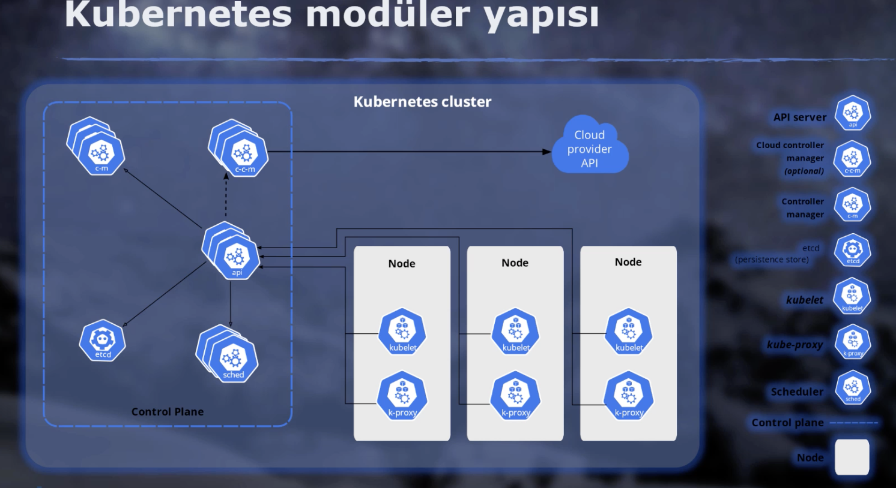

Bu kavramı anlamak için de gelin hayali bir senaryo kurgulayalım.

- Diyelim ki bir ekip olarak yeni bir e-ticaret uygulaması geliştiriyoruz ve bu uygulamamızı 4 ayrı modül olarak tasarladığımızı varsayalım.

	- Müşterilerimizin eriştiği bir frontend katmanı, uygulama ile ilgili ana işlemlerin yapıldığı bir backend, önbellekleme işlemleri için bir cache katmanı ve son olarak da verilerin tutulacağı bir veritabanı.
	- Production ortamımızda konteynırların gücünden yararlanmak istiyoruz.Bu nedenle tüm bu uygulamaları birer konteyner imajı haline getirdik.
	
	- Yani e-ticaret uygulamamız 4 modülden oluşuyor ve biz bunları 4 ayrı container olarak çalıştıracağız.
	- Uygulamamız hazır.
	- Container imajlarımız oluşturuldu.
	- Hemen cloud servis sağlayıcılarından birine gittik ve Ubuntu işletim sistemi yüklü bir sanal makine oluşturduk.
	- Bunun üstüne Docker kurduk.
	- Daha sonra uygulamayı ayağa kaldırmak için yapılması gerekenlere başladık.
		- Önce bu uygulamaların birbirleriyle konuşabilmeleri için bir Docker network oluşturduk.
		- Ardından uygulamaları çalıştırmak için çeşitli komutları girdik, volumler oluşturduk, loglarla ilgili ayarlamalar yaptık, bir sürü komut girdik ve uygulamamız çalışmaya başladı.
		- Biraz uğraştık, bir çok komut girdik, birçok iş yaptık ama ortamı ayağa kaldırmaya başardık. E-ticaret altyapımız çalışıyor. Müşterilerimiz bağlanmaya başladı ve bir süre bu ortamda bir değişiklik yapmadan idare edebildik.

	- Fakat gelin şimdi bu senaryoyu biraz ileriye saralım ve diyelim ki biz bu ortamda bazı sıkıntılarla karşı karşıya gelmeye başladık:
		- Öncelikle uygulamamız tek bir sunucu üstünde koşuyor.
		- Bu sistemde en ufak bir değişiklik yapsak bu kesintiye neden oluyor.
		- İşletim sistemi güncellemeleri, temel sistem bakımları ve benzeri işleri yapabilmek için arada sistemde kesinti yapmak zorunda kalıyoruz ve bu süre içerisinde de kullanıcılarımıza hizmet veremiyoruz. Doğal olarak bu hem işinizi aksatıyor hem de memnuniyetsizlik yaratıyor.

        - Bu sorunu çözmek adına ikinci bir sanal makine daha kurduk ve uygulamayı oluşturan tüm katmanların birer kopyasını bu sistem üzerinde oluşturduk.
		- Bu sanal makinelerin önüne bir load balancer koyduk ve çeşitli ayarlamalar yaparak bu sistemlerden bir tanesi devre dışı kalsa bile uygulamada kesinti olmadan diğer sistem üzerinden müşterilerimize hizmet vermeye devam edebildik. Bu sorunumuzu bu şekilde çözdük ama tek sorunumuz bu değildi.
		- Bu sefer ortamda uygulamamızın koştuğu 2 ayrı sistem vardı ve biz bir çok işi manuel yapmak zorunda kalıyorduk.
		- Bazen uygulamamızı oluşturan konteynırlarda bazı hatalar çıkıp kendiliğinden kapanıyordu.Bunu zar zor izleme sistemleriyle tespit edebilirsek bağlanıp tekrar o konteynırı ayağa kaldırdık ve bunun gibi gün içerisinde bir sürü işlem yaparak bu uygulamayı sorunsuz çalıştırmaya çalışıyorduk.
		- Bu işleri otomatize edebilmek adına scriptler yazmaya çalıştık. Bir sürü zaman harcadık ama tam olarak da beceremedik.Gün içerisinde birçok kez sistem sorunlarına müdahale ederek düzeltmeye çalışıyorduk.
		- Bunun dışında zaman ilerledikçe başka sorunlarımız da ortaya çıktı. Bazı günler kampanyalar yapıyorduk ve bu kampanya dönemlerinde yoğun trafik alıyorduk.Fakat sistemlerimiz bu trafiğe cevap verebilecek kapasitede değildi. Bu nedenle kesintiler yaşamaya başladık.
		- Bu sorunu çözmek adına iki yeni sanal makine daha kurduk. Sistemleri bunların üzerinde dağıtmaya başladık.Hangi konteynerden kaç tane oluşturmamız gerekir, bunları ayrı ayrı sanal makine üzerinde nasıl çalıştıracağız gibi konularda düşünmeye başladık. Bir sürü zaman ve emek harcayarak bunları tek tek oluşturduk. Fakat gittikçe büyümeye başladığımız için kapasite de zamanla yetmemeye başladı, iki sanal makine daha kurduk, aynı planlamayı bir daha yaptık.

		- Aynı zahmetli süreçlerden birini daha geçtik ve artık elimizde 6 ayrı makine üstünde koşan 20'den fazla konteynır var Ve bizim bunların hepsinin birçok parametresini manuel yönetmemiz gerekiyor.
			- Hangi uygulama kaç konteynır olarak hangi makinalar üzerinde çalışacak?
			- Bu konteynırların IP adresleri nelerdir?
			- Bu uygulamalar birbirleriyle hangi isimler ve IP adresleri üzerinden konuşacak ve benzeri birçok bilgiyi Excel dosyaları olarak oluşturmamız gerekti.
			- Zamanımızın büyük bir çoğunluğunu bunlarla harcamaya başladık derken iş daha da karmaşık bir hal almaya başladı.

	Uygulama başlangıçta 4 modül olarak kurgulanmıştı ama zamanla geliştirmeye devam ettik. Orta katmanı mikro servis mimarisinde yeniden yazdık.Tek monolit bir uygulamadan altı ayrı modüle döndürdük. Her modülü ayrı bir konteyner olarak çalıştırmaya başladık. Bunun yanında yine bu uygulama ile alakalı ve şirketin başka işlerinde kullandığımız birçok uygulama da denkleme girdi.Onlar da bu platformda çalıştırmaya başladık.

		- Derken, derken derken bir sene içerisinde elimizde 20 tane sanal makine üstünde koşan ve tamamen manuel yönettiğimiz 200'den fazla konteynır oldu ve tüm bu sistemi ayakta tutmak ve yönetmek için sabahtan akşama kadar uğraşıyor ve her şey manuel yapıyoruz. Artık sınırımıza geldik, iş neredeyse kontrolden çıkmış durumda, zar zor yetişiyoruz fakat şirket de büyümeye devam ediyor ve bu hızla devam edersek bu sistem altı ay sonra üç katı büyüklüğüne çıkacak. İşte o zaman havlu atacağız ve her şey darmaduman olacak. Çünkü bizim bu sistemi bu şekilde yönetmeye devam etme şansımız yok.

** Peki şimdi gelin biraz beyin jimnastiği yapalım ve birlikte tüm bu manuel işleri bizim adımıza halledecek hayali bir sistem tasarlayalım:

	- Acaba bu docker yüklü sistemleri adeta bir orkestra şefi gibi yönetecek bir sistem tasarlamak nasıl olurdu?

	- Tüm bu işlemleri manuel olarak tek tek sistemler üzerinde yapmak yerine, bu orkestra şefine Benim uygulamam şu şu komponentlerden oluşuyor, bu komponentler şu özelliklerde ve sayıda olacak, bu servisler birbirleriyle konuşacak, şunlar da dış dünyadan gelen istekleri karşılayacak diye sistemin olmasını istediğim halini söylesem de, o benim adıma tüm bunları ayağa kaldırsa, hangi konteyner hangi sistemde koşacak, Bunların yük dağılımları nasıl olacak, hangi sistemde yeni konteyner oluşturmak için kapasite mevcut gibi şeylere karar verse, bunun yanında benim Excel dosyaları olarak tuttuğum IP bilgileri gibi kayıtları kendi üzerinde barındırsa ve daha da ileri gidip sistemi sürekli gözleyerek yanlış giden durumlarda devreye girip otomatik olarak sistemi benim istediğim konfigürasyonda tutmaya çalışsa.

	- Misal bu docker yüklü platformlardan bir tanesinde sıkıntı olduğunda, onun üzerinde çalışan konteynırları devre dışı bırakarak, o yükleri sorunsuz çalışan diğer sistemler üzerinde dağıtmaya başlasa, sistemdeki problemleri otomatik iyileştirse.

	- Kısacası ben tüm orkestrayı ve müzik aletlerini tek tek ayarlamaya çalışmak yerine, orkestra şefine çalışmasını istediğim şarkının notalarını versem de, o şef orkestrayı yöneterek bunun sorunsuz bir şekilde çalışmasını sağlasa güzel olmaz mıydı?

	- **İşte bu güzelliği de konteyner orkestrasyon sistemleri diyoruz arkadaşlar.

Arkadaşlar genel olarak konteyner orkestrasyon konsepti olarak bilinen ve az önce açıkladığım gibi yüzlerce farklı konteynerden oluşan sistemleri düzgün şekilde oluşturup yönetmemizi sağlayan bazı araçlar var.

*** Bunların en bilinenleri de Docker tarafından oluşturulmuş olan Docker Engine içerisinde Docker bir parçası olarak gelen Swarm ve diğeri de Cloud Computing Foundation tarafından açık kaynak bir proje olarak yürütülen ve artık neredeyse sektörün tamamı tarafından standart konteyner orkestrasyon aracı olarak benimsenen ve bizim de eğitimimizin konusu olan Kubernetes.

** Bunun dışında Apache OS ya da Nomad gibi başka araçlar da var.
Fakat tüm bu araçların içinden sıyrıldığı ve az önce dediğim gibi neredeyse sektör standardı haline geldi.

Kubernetes bir konteyner orkestrasyon platformu.

Özetle yaptığı iş bu.

Fakat bu Kubernetes tam olarak anlatmaya yetmiyor.